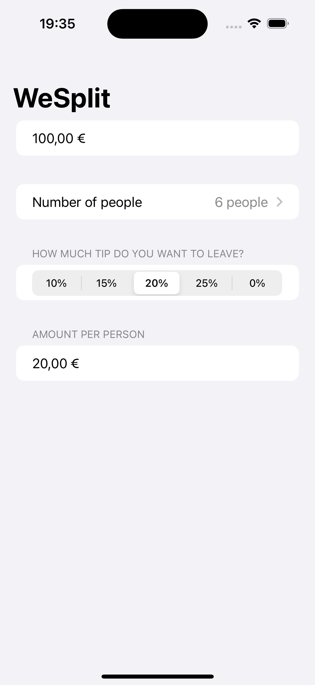
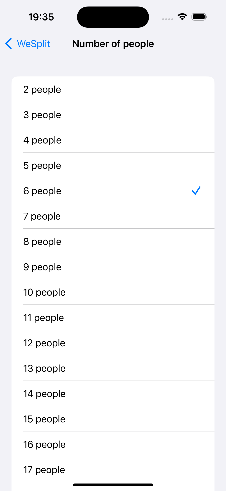

# WeSplit 💸

|  |  |
| --------------------- | --------------------- |

Split the check between everyone on the table. Made by following the [Hacking with iOS: SwiftUI Edition](https://www.hackingwithswift.com/books/ios-swiftui) book.
